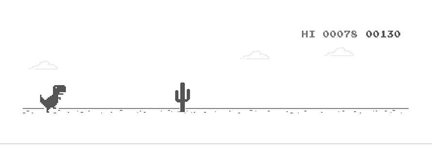

# README ABOUT ME #

Hello,  my name is {{name}}.

This is my Official GitHub Account.

## Projects ##


### {{group.name}} ###

| Project name | License | Technoloy | Description |
| ------------ | ------- | --------- | ----------- |
| [{{project.name}}]({{project.link}}) |   |   | {{project.description}} | 


No projects yet. I said **"not yet."**




## Social ##

  No links yet. I said "not yet."

## LeetCode ##

## Codewars ##

## Duolingo ## 

## Others ##

----

Last Updated: {{last_updated}}
